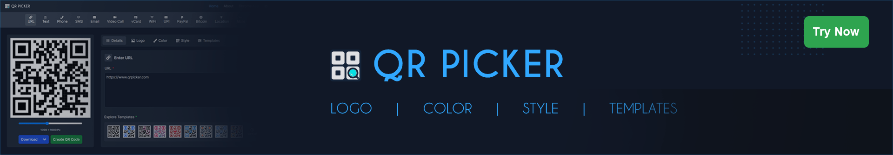

## Hi there 👋, I'm Ashim

As a senior software developer and UI/UX designer, I enjoy crafting clean, functional applications that blend thoughtful design with real-world impact. I thrive on building intuitive user experiences, writing maintainable code, and turning ideas into reliable, elegant software. Whether it's shaping a smooth front-end interface or architecting a solid back-end, I’m driven by a passion for purposeful, user-focused development.

 

### More About Me

- 💼 Senior Software Developer at [**Mutesoft Technologies**](https://mutesoft.com/).
- 🔭 Currently working on updating my [**Portfolio**](https://ashimsaha.net/) website.
- 🧠 Passionate about building clean, practical software solutions.
- 🚀 Built [**QR Picker**](https://qrpicker.com/): a professional QR code generator for [**web**](https://qrpicker.com/) and [**Chrome**](https://chromewebstore.google.com/detail/odmflkpkpjbneglnkhocaildbhjiefch).
- 💬 Happy to chat about anything tech.
- 📫 Connect with me on [**LinkedIn**](https://www.linkedin.com/in/ashimsahadev/).

 

### Latest Blog Posts

- [**Leaflet + OpenStreetMap: A Free and Open-Source Alternative to Google Maps**](https://ashimsaha.net/blogs/leaflet-osm-a-free-and-open-source-alternative-to-google-maps)  
  _Build interactive, mobile-friendly maps with Leaflet and crowd-sourced OSM data._

- [**The Ultimate Guide to Vite Plugin Sitemap**](https://ashimsaha.net/blogs/vite-plugin-sitemap)  
  _Auto-generate `sitemap.xml` and `robots.txt` in Vite builds for SEO-friendly sites._
  
- [**Add Code Blocks to Your React Blog Using React Syntax Highlighter**](https://ashimsaha.net/blogs/code-block-using-react-syntax-highlighter)  
  _Display gorgeous, readable code snippets in any React-based blog or docs site._

 

### Languages & Tools

  

 

### Connect with Me

  
  
  
  

